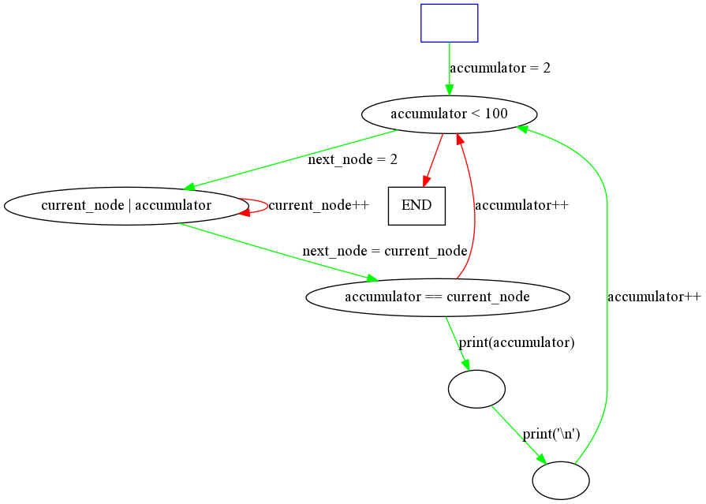

Syntax
------

Programs in Quiver are directed graphs (digraphs), where

* Vertices are conditions, and
* Edges are side effects.

The execution will flow through that graph, jumping from vertex to vertex. Each vertex has two outgoing edges, one will be followed if the condition in the vertex is true, the other if the condition is false.

A program in Quiver is a list of nodes. Each node has 

1. A node number,
1. A condition,
2. A node to jump to if the condition is true,
3. An action to perform if the condition is true,
4. A node to jump to if the condition is false,
5. An action to perform if the condition is false,

There are two distinguished edges: the starting vertex and the 'halt' vertex. The first one is the one where the program starts, and the other one is where the program ends (if the programs arrives to it, it halts). The starting vertex will be the vertex with the smallest number.

The syntax for a node is

```
<number>?<condition>?<node_if_true>(<action_if_true>)<node_if_false>(<action_if_false>)
```

To specify that you want to go to the 'halt' vertex, you should leave `node_if_[true|false]` empty.
  
A program in Quiver is just a list of nodes. Let's see an example.

```
0??('Hello, World!\n)()
```

That is "Hello, World!" in Quiver. It starts in 0. The empty condition evaluates to True, so it jumps to the halt node, writing "Hello, World!" to the screen. Note that there's only one `'`.

State
-----

There's also state in Quiver.
There's a global accumulator that you can always see and modify,
and also each node has a value that you can see and modify only when you are in that node.

All values start in 0. The starting value of the accumulator can be set passing it as a parameter.

Let's see an example of that being used, a program that outputs the numbers from 1 to 10.

```
0??1(1)()
1?<11?2(p)()
2??3('\n)()
3??1(++)()
```

Let's see what happens:

1. It starts in node 0 and jumps to 1. The action `(1)` means just assign 1 to the accumulator.

2. In node 1, if the accumulator is greater than or equal to 11, it halts. If it is less, it jumps to 2, and you print it (that is what `p` does, it prints the accumulator).

3. It prints `\n` and jumps to 3.

4. It jumps to 1 and increments the accumulator.


Here you can clearly see what's going on. Green edges mean true branch, while red edges mean false branch. The blue box is the starting node.

This graph was generated automatically, we will learn later how.


Advanced Quiver
---------------

Let's look at more advanced stuff. The following program outputs all prime numbers from 1 to 100.

```
1??2(2)()
2?<100?3(]=2)()
3?@|?4(~>)3([++)
4?==?5(p)2(++)
5??6('\n)()
6??2(++)()
```

What does this do?

1. It assigns 2 to the accumulator and jumps to 2.

2. It compares the accumulator with 100, if it is 100 or more, it halts, if it is less it goes to three. `]=2` means that it assigns 2 (`=2`) to the value of the next node, i.e. 3. To assign to the current node (2) you have to do `[`.

3. It checks if the value inside current node divides the accumulator. `|` is simply that, it checks divisibility. The thing is that `|` alone would check if accumulator divides current\_node, because accumulator is always the first operand, so `@` flips the operands.

  1. If current\_node divides accumulator, then it copies the value from current\_node to next\_node, i.e., from 3 to 4.

  2. If it doesn't divide it, it increments its value, and jumps to itself.

4. Suppose we moved to 4. So now we have a value that divides the accumulator, that we moved from 3 to 4. If that value is equal to the accumulator, it means that accumulator is prime, because it's not divisible by any number less than itself. So in that case we print it. Either case we increment it and jump back to 2.

5. Go to step 2.




A detail
--------

Programs in Quiver must have at least one vertex other than the end node, so the smallest possible program in Quiver is

```
0??()()
```

And it does nothing.
